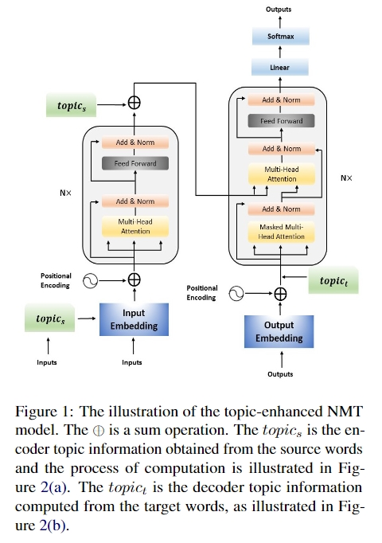
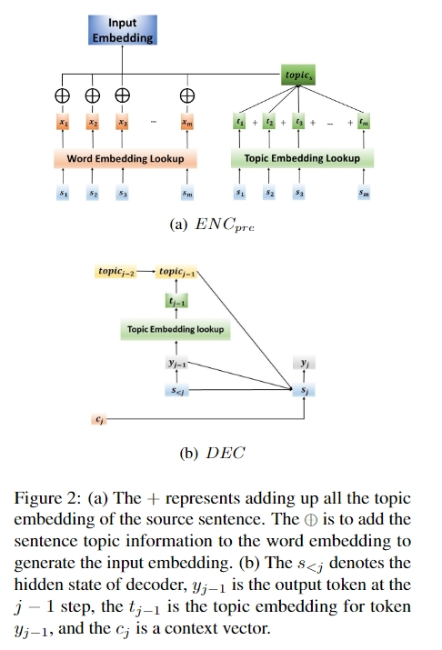
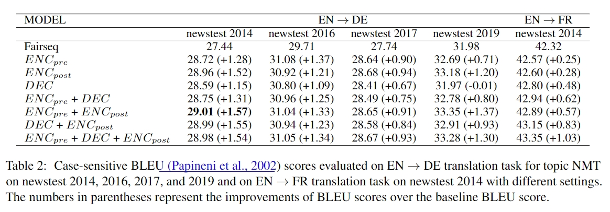
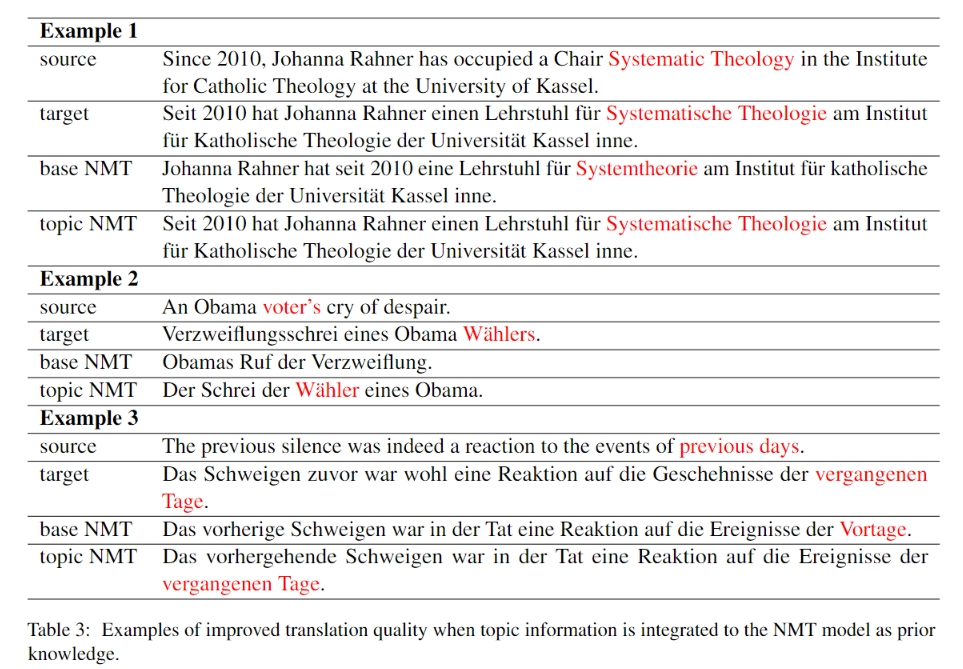

<h1 align=center>Neural Machine Translation with Heterogeneous Topic Knowledge Embeddings</h1>

<h2 align=center>Abstract</h2>
Neural Machine Translation (NMT) has shown a strong ability to utilize local context to disambiguate the meaning of words. However, it remains a challenge for NMT to leverage broader context information like topics. In this paper, we propose heterogeneous ways of embedding topic information at the sentence level into an NMT model to improve translation performance. Specifically, the topic information can be incorporated as pre-encoder topic embedding, post-encoder topic embedding, and decoder topic embedding to increase the likelihood of selecting target words from the same topic of the source sentence. Experimental results show that NMT models with the proposed topic knowledge embedding outperform the baselines on the English → German and English → French translation tasks.

<h2 align=center>Methodology</h2>

<table>
<tr>
  <td width="50%" align="left" valign="middle"></td>
  <td width="3%"> </td>
  <td width="50%" align="left" valign="middle"></td>
</tr>
</table>

Figure 1 illustrates the proposed topic-enhanced NMT model with topic ENC-pre, ENC-post, and DEC, built upon the Transformer architecture. The topic knowledge in the figure is obtained from the topic embedding tables for source and target languages produced by ETM.

The word embedding is obtained by looking up the word embedding table, which is randomly initialized and updated with training. The topic embedding table is pre-calculated as the intermediate product of ETM, and it is fixed during the NMT training process. Then we add up all the topic embedding in the sequence to produce the topic information distribution of the whole sentence, added to each word embedding of the input source words. Finally, we take the added word embedding representation as the input embedding and feed it into the encoder or decoder.

<h2 align=center>Experiments</h2>

<table>
<tr>
  <td width="80%" align="middle" valign="middle"></td>
</tr>
</table>

To investigate the effectiveness of our topic NMT model and study the main factor that influences the experiment results, we also compare different topic NMT on the newstest 2014, 2016, 2017, and 2019 dataset for EN → DE and the newstest 2014 for EN → FR.

<h2 align=center>Examples</h2>

<table>
<tr>
  <td width="80%" align="middle" valign="middle"></td>
</tr>
</table>

Examples of topic-enhanced NMT for EN → DE are shown in Table 3. For example, the base NMT model mistranslates “Systematic Theology” to “Systemtheorie” (systems theory in English), which is accurately translated to “Systematische Theologie” by the topic-enhanced NMT model.

<h2 align=center>Bibtex </h2>

@inproceedings{wang2021neural,
  title={Neural machine translation with heterogeneous topic knowledge embeddings},
  author={Wang, Weixuan and Peng, Wei and Zhang, Meng and Liu, Qun},
  booktitle={Proceedings of the 2021 Conference on Empirical Methods in Natural Language Processing},
  pages={3197--3202},
  year={2021}
}
```
